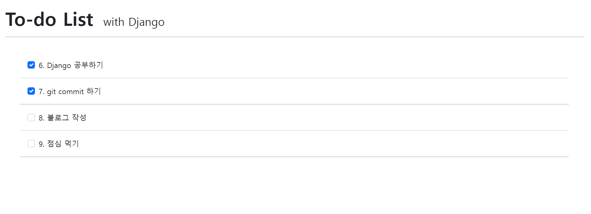
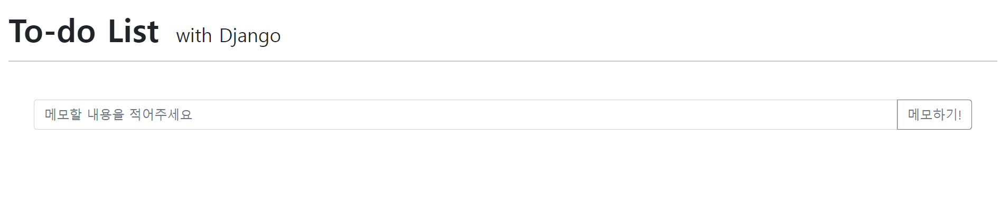

# To-do List 만들기

## index 페이지



## new 페이지




### 1. 기본 파일 구조(주요 파일만)

- templates
  - `base.html`
- todo_lists
  - migrations
  - templates/todo_lists
    - `create.html`
    - `index.html`
    - `new.html`
  - `admin.py`
  - `apps.py`
  - `models.py`
  - `urls.py`
  - `views.py`
- ToDoList
  - `settings.py`
  - `urls.py`
- venv
- manage.py


1. `base.html`에 기본 html의 구조와 bootstrap의 cdn을 작성하여 다른 html 파일에서 활용할 수 있도록 만들었다. 
2. `index.html`에서는 테이블 전체의 content와 pk값을 받아와서 보여준다.
3. `new.html`에서 내용을 입력하면 `index.html`로 이동해 전체 목록을 볼 수 있게 만들어 준다. 


### 2. models.py

```python
from django.db import models


class Todo(models.Model):
    content = models.TextField()

    
    def __str__(self):
        return f'{self.pk}. {self.content}'
```

- Todo라는 클래스를 생성하여 텍스트 형식으로 content를 저장할 수 있도록 만들었다. 


### 3. views.py

- 위에서 만든 class를 import해서 사용했다.
- index 페이지에선 전체 데이터를 조회해서 접근할 수 있도록 해주었다.

```python
def create(requset):
    
    content = requset.POST.get('content')
    todo = Todo(content=content)
    todo.save()

    return redirect('todo_lists:index')
```

- create 함수를 만들어서 `new.html`에서 내용을 입력하면 해당 내용을 테이블에 추가하고 index페이지로 이동할 수 있게 했다. 


### 4. new.html

- form태그의 액션을 `"` url을 사용하여 create로 전달될 수 있게 만들었다. 

- 처음엔 input에 값을 넣어도 index 페이지로 이동하지도 않고, 값이 테이블에 추가되지도 않는 오류가 발생했다.

  => input에 name을 지정해주지 않고 views.py 의 create 함수에서 호출하고 있었기 때문이었다. input에 name을 지정해주니 정상적으로 동작하였다. 


### 5. index.html

- 테이블의 모든 값을 보여주기 위해 for를 사용해 값을 하나씩 보여줄 수 있게 만들었다. 